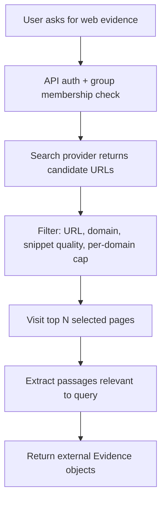

# Web Search Evidence Tool Design

Last updated: 2026-06-17

## Goal

Add controlled web search to Semantic Lighthouse without turning the Agent into an uncontrolled browser.

The goal is not:

```text
search web -> paste raw webpages into the model
```

The goal is:

```text
search web -> filter source quality -> selectively visit pages -> extract relevant passages -> return auditable external evidence
```

This feature should complement the internal knowledge base. Internal group-scoped documents remain the primary source. Web search is used when:

- internal evidence is missing or weak
- the user explicitly asks for current/public information
- the answer's next steps suggest checking public examples, vendor docs, news, or standards

## Design Principle

External tools must return `Evidence`, not raw text.

Each web result should carry:

- source URL
- title
- domain
- provider
- snippet or extracted passage
- relevance score
- source quality label
- retrieval timestamp
- filtering reason
- whether full-page content was visited

This keeps the project consistent with existing RAG citation design: traceable source, confidence judgment, and auditability.

## Provider Research Snapshot

- Firecrawl Search can return titles, descriptions, URLs, and optionally scrape full-page content in the same endpoint. It also supports domain filters and a two-step search-then-scrape pattern, which matches our need to filter before reading full pages.
- Tavily Search is also viable. It exposes `search_depth`, per-result scores/content, optional raw content, and credit usage. It is useful for quick search-result snippets and answer-oriented search, but we should avoid consuming its generated answer directly because Semantic Lighthouse owns the final answer contract.
- Exa is strong for neural search and highlights. It returns highlights, highlight scores, summaries, and cost metadata, but is a less necessary first choice for this project's explainable MVP.
- Bing Web Search docs are now under previous-version Microsoft Learn pages, so it is not the first choice for a fresh student project unless there is a specific Azure requirement.

Initial recommendation: **Firecrawl first**, with a provider interface so Tavily or Exa can be added later.

References:

- Firecrawl Search docs: https://docs.firecrawl.dev/features/search
- Tavily Search docs: https://docs.tavily.com/documentation/api-reference/endpoint/search
- Exa Search docs: https://exa.ai/docs/reference/search
- Microsoft Bing Search docs: https://learn.microsoft.com/en-us/previous-versions/bing/search-apis/bing-web-search/

## MVP Scope

### P0: Design Only

Current step. Define boundaries and risk controls before implementation.

### P1: Web Search Evidence API

Add a read-only endpoint:

```text
POST /groups/{group_id}/web-search
```

Input:

```json
{
  "query": "企业为什么需要 ontology 的公开案例",
  "limit": 5,
  "include_domains": [],
  "exclude_domains": [],
  "visit_top_n": 2
}
```

Output:

```json
{
  "query": "...",
  "provider": "firecrawl",
  "results": [
    {
      "title": "...",
      "url": "...",
      "domain": "...",
      "snippet": "...",
      "extracted_passages": ["..."],
      "score": 0.82,
      "quality_label": "usable",
      "filter_reason": "domain allowed, snippet has query overlap",
      "visited": true,
      "retrieved_at": "..."
    }
  ]
}
```

Permission:

- Member can search.
- Results are read-only.
- No web result is written into the group knowledge base by default.
- If later adding "save external evidence", only Owner/Admin should be allowed.

### P2: UI Integration

Add a small "联网补充" panel after a low-confidence RAG answer:

- Button: `联网查找补充证据`
- Show external results separately from internal citations.
- Label them clearly as `外部来源`.
- Do not silently mix external web evidence into internal citations.

This avoids misleading users into thinking public web evidence has the same trust level as curated group knowledge.

### P3: Optional RAG Integration

Only after P1/P2 are stable:

```text
internal retrieval -> if weak evidence and user allows web -> web evidence -> answer contract
```

The answer must state:

- which citations came from internal KB
- which citations came from web search
- whether confidence depends on external sources

## Source Quality Rules

Start simple:

1. Reject empty title/snippet/url.
2. Reject unsupported schemes except `http` and `https`.
3. Reject known low-quality domains via config.
4. Prefer official/vendor/docs domains when query contains product/vendor names.
5. Cap results per domain to avoid one site dominating.
6. Cap extracted passage length.
7. Store provider request ID or provider metadata if available.

Do not overbuild:

- no crawler
- no scheduled monitoring
- no browser automation in P1
- no automatic web-to-knowledge-base ingestion
- no autonomous Agent browsing loop

## Data Model

P1 can avoid a migration by returning transient search results.

If audit persistence is needed in P2/P3, add:

```text
web_search_runs
- id
- group_id
- user_id
- query
- provider
- status
- result_count
- duration_ms
- error_message
- created_at

web_search_results
- id
- run_id
- group_id
- title
- url
- domain
- snippet
- extracted_passages_json
- score
- quality_label
- filter_reason
- visited
- retrieved_at
```

Persisting is useful if external evidence is used in final RAG answers. It is unnecessary for the first smoke version.

## Provider Abstraction

Suggested module:

```text
src/semantic_lighthouse/services/web_search.py
```

Core types:

```python
class WebSearchClient(Protocol):
    def search(self, request: WebSearchRequest) -> WebSearchResponse: ...

class FakeWebSearchClient:
    ...

class FirecrawlWebSearchClient:
    ...
```

Config:

```text
WEB_SEARCH_PROVIDER=fake|firecrawl
FIRECRAWL_API_KEY=
WEB_SEARCH_TIMEOUT_SECONDS=20
WEB_SEARCH_DEFAULT_LIMIT=5
WEB_SEARCH_VISIT_TOP_N=2
WEB_SEARCH_EXCLUDE_DOMAINS=
WEB_SEARCH_MAX_PASSAGE_CHARS=1200
```

Testing must use `fake`, never the real API.

## Search Then Visit Flow



## Relevance Filter

P1 should use a cheap heuristic first:

- tokenize query
- compute overlap with title/snippet/passage
- boost official domains and docs pages
- penalize forums, Q&A mirrors, aggregator pages, and very short content

Embedding rerank can be added later only if heuristic quality is not enough.

Why not embedding first:

- web search is user-facing and latency sensitive
- each query can return many passages
- cloud embedding cost adds up
- query/passage language mismatch can be handled later with translation or embedding fallback

## Failure Modes

| Failure | Expected behavior |
|---|---|
| Missing API key | Return clear 503/502-style error; UI says provider not configured |
| Provider timeout | Return no web evidence; do not break internal RAG |
| Too many low-quality results | Return filtered result count and reasons |
| Page scrape fails | Keep search result but mark `visited=false` |
| User asks unsafe query | Do not execute if it violates policy or configured domain rules |
| External source conflicts with internal KB | Answer must mention conflict and avoid high confidence |

## Test Plan

Backend:

- non-member cannot call web search
- member can call fake web search
- missing provider key gives clear error
- invalid URL scheme is filtered
- low-quality domain is filtered
- per-domain cap works
- `visit_top_n` only visits selected results
- timeout/provider failure does not write partial trusted data

Frontend:

- low-confidence answer shows "联网查找补充证据"
- external results render separately from internal citations
- loading and error states are Chinese

No real web API in unit tests.

## Interview Story

> 我没有把联网搜索做成简单的 Search API wrapper。外部网页质量不可控，所以我把搜索结果先变成可审计的 Evidence：来源 URL、域名、snippet、相关性分数、过滤原因、是否访问全文。内部知识库仍然是主证据，联网搜索只作为低可信或知识缺口场景的补充。这样可以避免把导航、广告、评论、SEO 垃圾直接喂给模型，也能在审计时解释每条外部引用为什么进入上下文。
